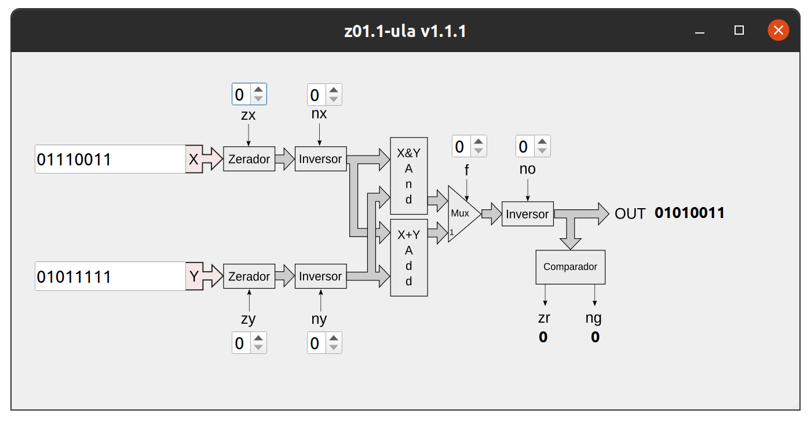

## 1. install

Instale o pyQt do pyside2:

``` sh
sudo apt-get install python3-pyside2.qtgui
```

Instale as dependencias do python:

``` bash
pip3 install -r requirements.txt --user
```

## 2. Execute

``` sh
python3 main.py
```

`
`
